# Flavr Website

[](https://flavr-frontend-7f4unumgt-monkass-projects.vercel.app/)
[](https://opensource.org/licenses/MIT)

A Neobrutalist platform for restaurant evaluation. Flavr combines a modern, bold aesthetic with a robust backend to provide a fair and transparent discovery experience for food lovers, while offering restaurant owners a comprehensive dashboard to manage their profiles and engage with their community.

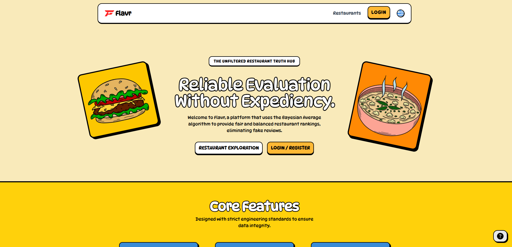
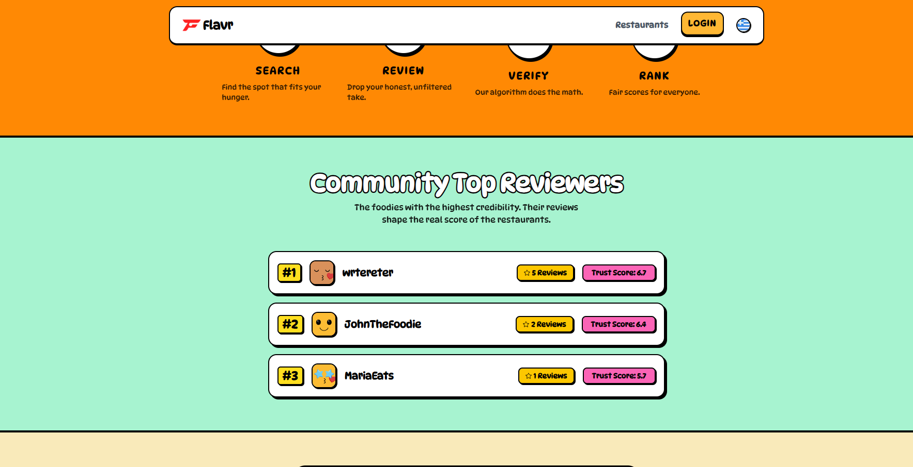
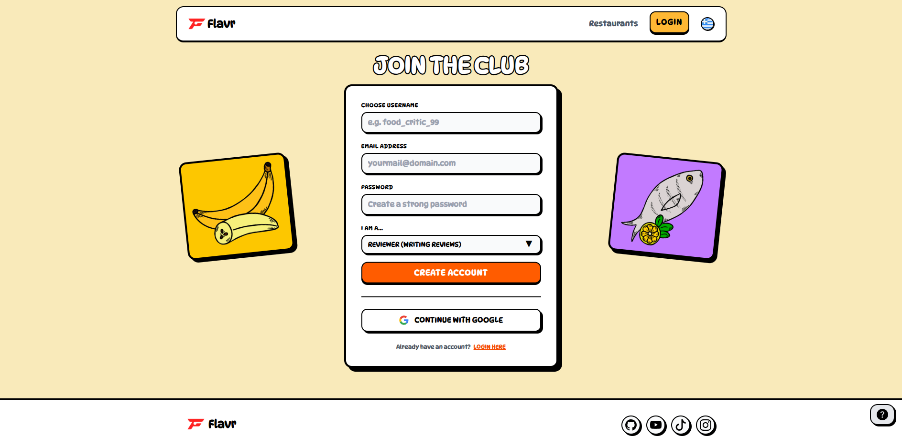
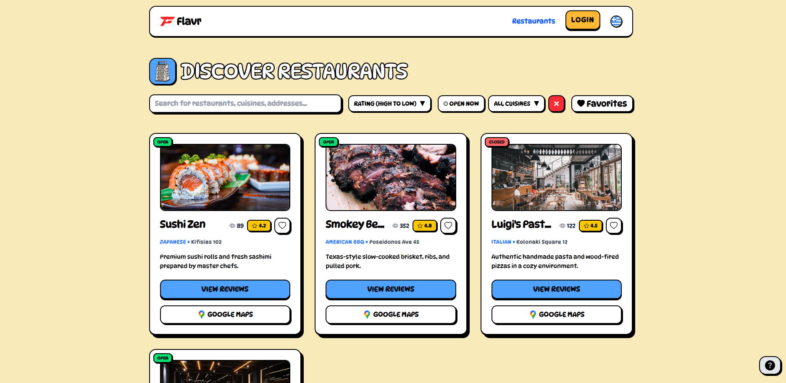
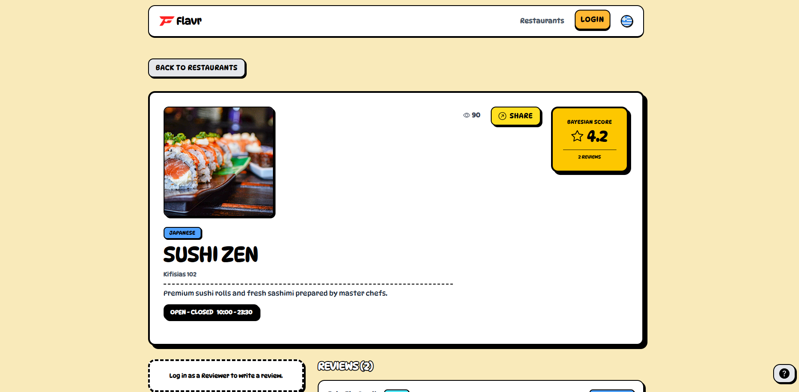
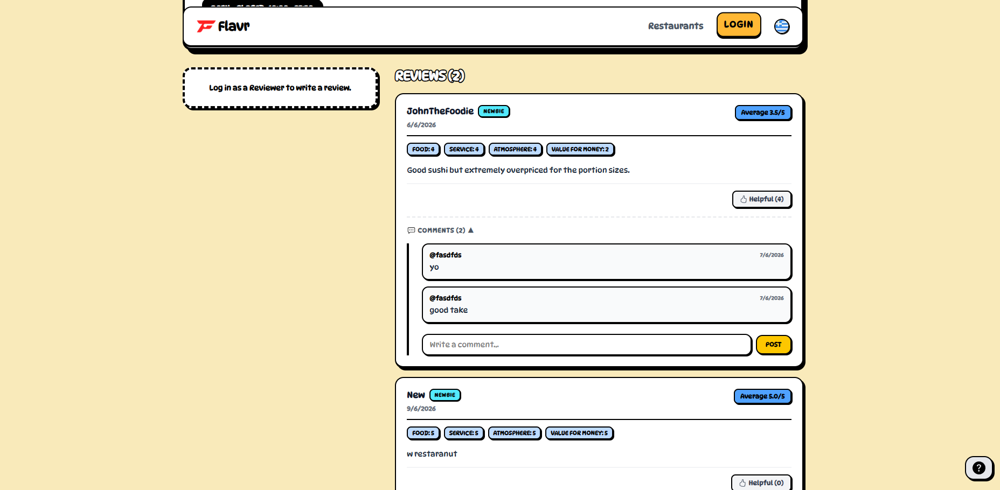

## ✨ Core Features

* **Bayesian Rating System:** Implements a statistical ranking algorithm to ensure fair, accurate restaurant scores that aren't skewed by outliers.
* **Owner Dashboard:** A dedicated space for owners to manage business details, including operating hours, location, and direct responses to customer reviews.
* **Interactive Media Gallery:** Features a sleek lightbox-enabled gallery, allowing users to explore restaurant imagery with a modern Neobrutalist touch.
* **Seamless Navigation:** Integrated "Go to Maps" functionality that uses encoded addresses for instant, accurate directions.
* **Role-Based Security:** Strict backend authorization ensuring that only the verified owners of a specific restaurant can modify its data or reply to reviews.
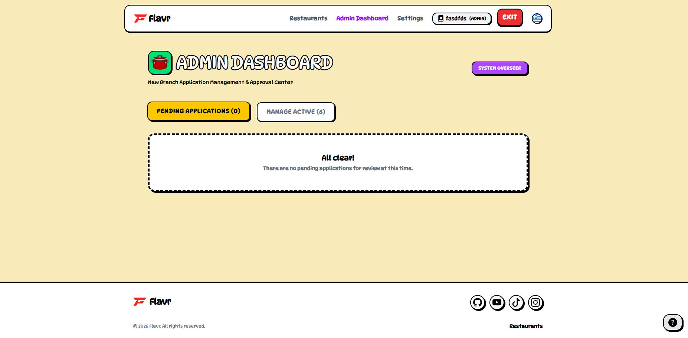
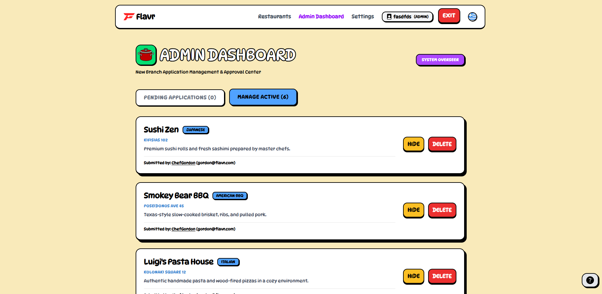
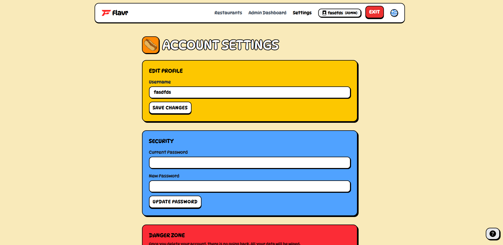
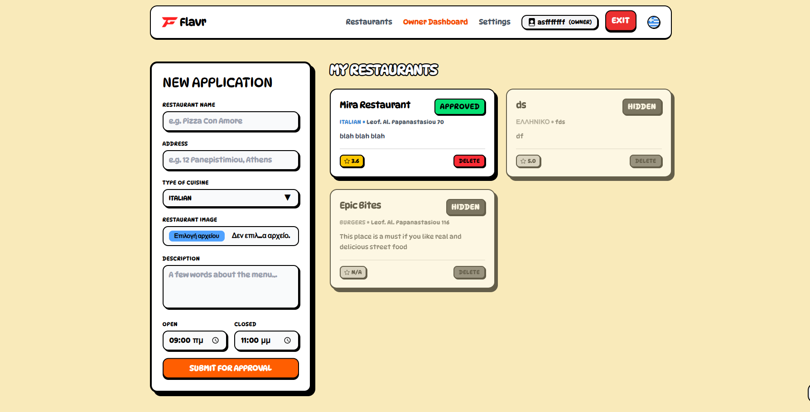
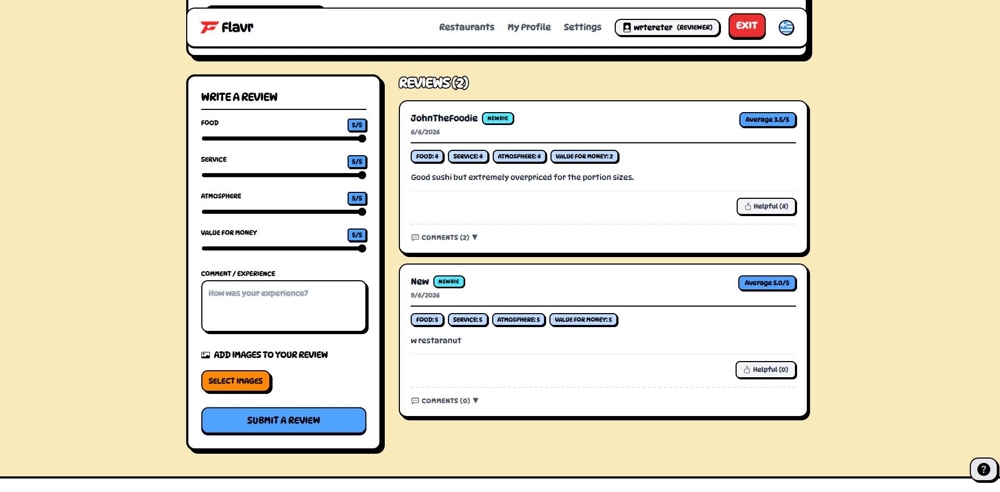

## 🛠️ Built With

<p align="left">
  
  
  
  
  
</p>

## 🚀 Getting Started

1. **Clone the repository:**
   ```bash
   git clone [https://github.com/yourusername/flavr.git](https://github.com/yourusername/flavr.git)
